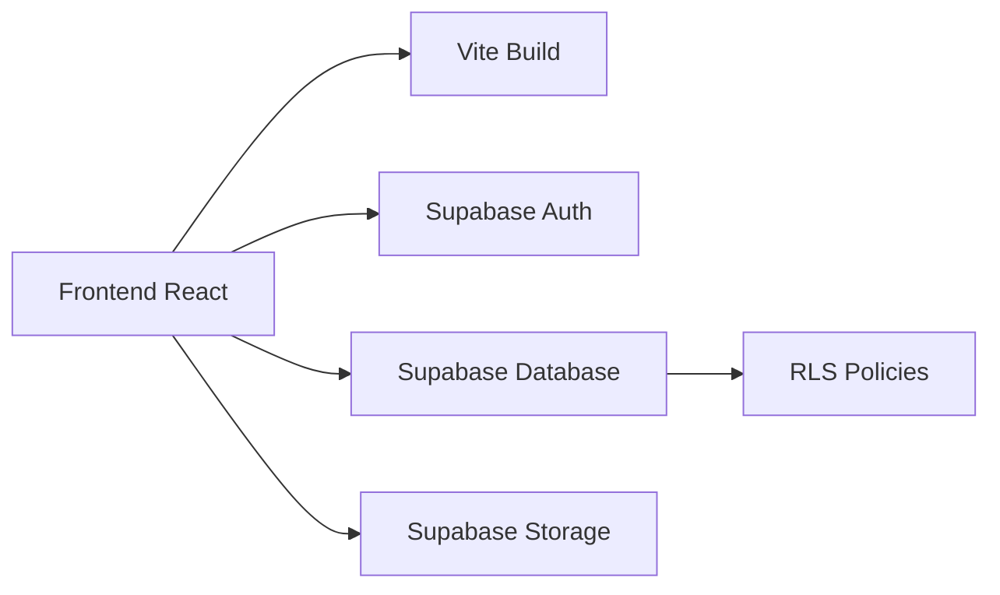
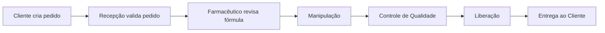
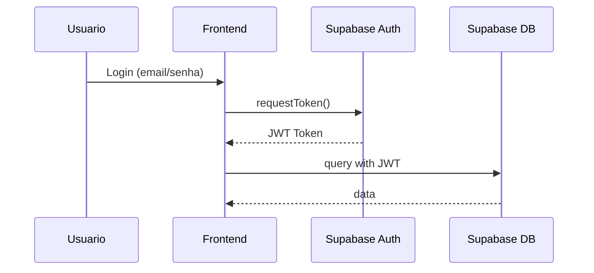
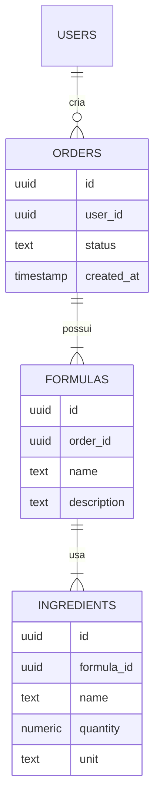
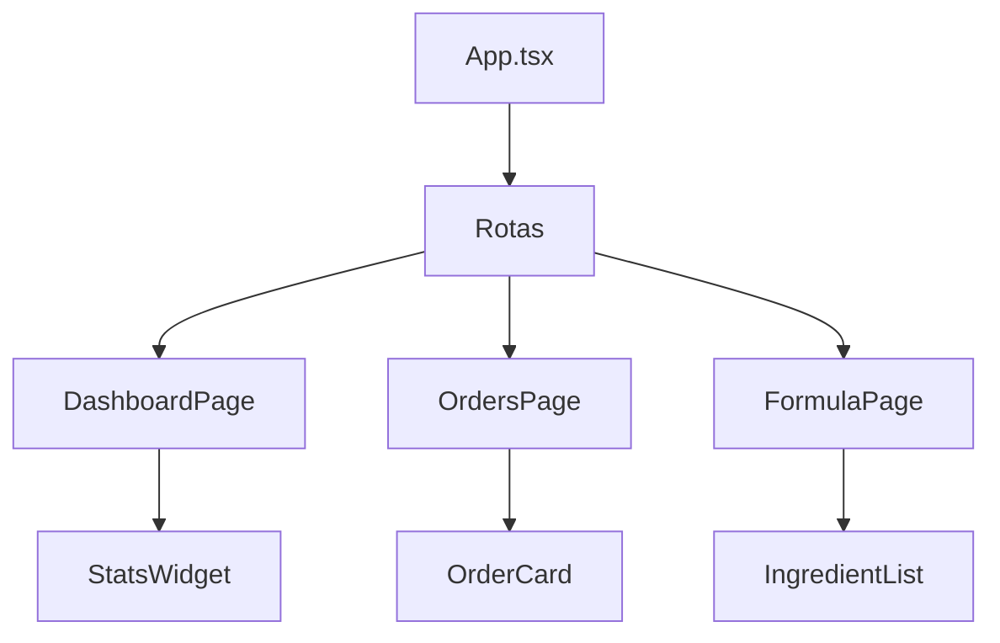

# 💊 Substractum — Gestão de Manipulados  
### React + Vite + Supabase + Tailwind + shadcn/ui

<div align="center">


</div>

---

# 📝 Descrição

O **Substractum** é um sistema web destinado a **farmácias de manipulação**, oferecendo:

- Gestão de **pedidos**  
- Controle de **fórmulas e insumos**  
- Acompanhamento de **produção** e etapas  
- Rastreabilidade e auditoria  
- Perfis com diferentes permissões  
- UI moderna e responsiva  

---

# 🧭 Arquitetura — Diagramas (Mermaid)

## 📌 1. Arquitetura Geral


## 📌 2. Fluxo Completo: Pedido → Produção → Entrega


## 📌 3. Fluxo de Autenticação


## 📌 4. ERD do Banco (Supabase)


## 📌 5. Diagrama de Componentes Frontend


---

# 🧪 Testes Automatizados (Vitest)

### Instalar
```bash
npm install -D vitest @testing-library/react @testing-library/jest-dom
```

### Configuração
```ts
test: {
  globals: true,
  environment: "jsdom",
  setupFiles: "./src/tests/setup.ts"
}
```

### Exemplo
```tsx
import { render, screen } from "@testing-library/react";
import App from "../App";

test("renders Substractum title", () => {
  render(<App />);
  expect(screen.getByText(/Substractum/i)).toBeInTheDocument();
});
```

---

# 🚀 Como rodar localmente

```bash
npm install
npm run dev
npm run build
npm run preview
```

---

# 🇺🇸 English Version

## 💊 Substractum — Compounding Pharmacy Management System

This system was designed for compounding pharmacies to manage:

- Orders, formulas, ingredients  
- Production workflow  
- Traceability & auditing  

---

# 📄 License

Private proprietary repository.

